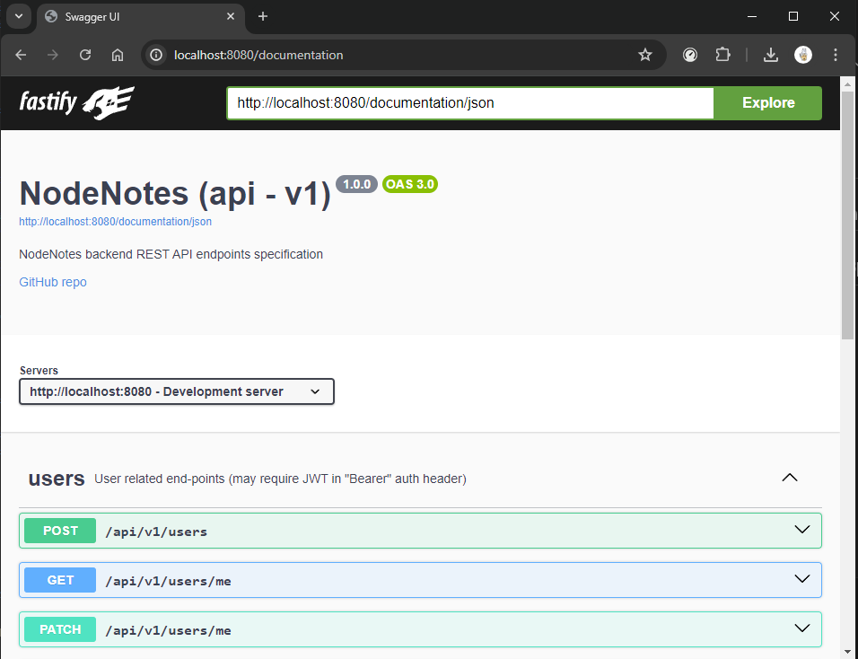

# `Node.js` and `Fastify` **RESTful API** boilerplate


### REST API and *Clean Architecture* boilerplate/template written in `Node.js` and `Fastify`
 This is *notion-like* note application backend and *Clean Architecture boilerplate* with registration, authorization, collaborating, etc. You can create note, add tags to it and filter your notes, add and remove collaborators, customize your profile.

### **Features**
+ User registration and authorization by `JWT`
+ User's profile update
+ User password change
+ Note creation with tags and collaborators
+ Note edit
+ Receiving notes with pagination, update date sorting, tags filtering
+ Adding and removing collaborators


## **How to launch**
> To launch application tou need to install `Docker` and `Docker Compose` on your system

1. Clone git repository and go to the directory
``` Shell
git clone https://github.com/LCcodder/NodeNotes
cd NodeNotes
```
2. Edit environment variables in `docker-compose.yaml` as you want 
3. Run 
```Shell
docker compose up --build
```

## **`Jest` unit tests**
- App covered with `Jest` unit tests
- Coverage `85%`

To run all testsheets enter:
```
npm test
```

## **`Postman` e2e tests**

+ App covered with e2e tests
+ `100%` coverage, over 280 tests

You can find testsheets in `tests/e2e/api_v1.postman_collection.json`

## **`pgAdmin` panel** 

1. Go to the `http://localhost:5050`
2. Log in with email: `admin@pgadmin.com` and password: `password`
3. Run
```
docker ps -a 
```
4. Find and copy `postgres` container id
5. Run
```
docker inspect <copied container id>
```
6. Find `IPAddress` with *172* prefix and copy it
7. Now add server in `pgAdmin` and paste copied IP in `host` input
8. Complete all other inputs
## **`Swagger` API specification**
#### WebApp supports `Swagger` `OpenApi` spec viewer
#### Use `http://localhost:8080/documentation` to go to the `SwaggerUI` page 


---
### Everything, including `Postman` tests, unit tests, `GitHub ci/cd`, `Docker compose` and API itself was created and written by [LCcodder](https://github.com/LCcodder)